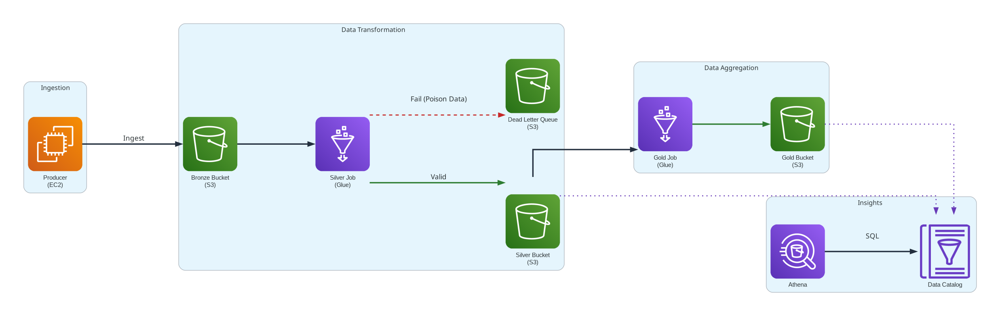

# E-commerce Medallion Data Pipeline on AWS

<div align="center">



**A production-ready, serverless ETL pipeline for processing e-commerce transaction data on AWS**

[](https://opensource.org/licenses/MIT)
[](https://www.terraform.io/)
[](https://aws.amazon.com/)
[](https://www.python.org/)

[Features](#features) •
[Architecture](#architecture) •
[Getting Started](#getting-started) •
[Usage](#usage) •
[License](#license)

</div>

---

## Overview

This project implements a fully automated, serverless ETL (Extract, Transform, Load) pipeline for processing e-commerce transaction data using AWS services. Built with infrastructure-as-code principles using Terraform, it demonstrates best practices for data engineering on AWS.

The pipeline continuously generates realistic e-commerce order data, processes it using AWS Glue, stores it in a partitioned data lake on S3, and enables SQL analytics through Amazon Athena.

## Features

- **Automated Data Generation** - EC2 instance generates realistic e-commerce orders every 5 minutes

- **Scheduled ETL Processing** - AWS Glue job runs hourly to transform and partition data

- **Partitioned Data Lake** - Efficient data storage partitioned by `region/year/month`

- **SQL Analytics** - Query your data using Amazon Athena with standard SQL

- **Infrastructure as Code** - Complete AWS infrastructure provisioned via Terraform

- **Cost-Effective** - Serverless architecture minimizes operational costs

## Architecture

The pipeline follows a modern data lakehouse architecture:

1. **Data Generation Layer (EC2)** - Simulates real-time e-commerce transactions
2. **Storage Layer (S3)** - Raw and processed data stored in partitioned structure
3. **Processing Layer (AWS Glue)** - Serverless Spark jobs for ETL transformations
4. **Query Layer (Amazon Athena)** - SQL interface for data analysis

### Data Schema

The pipeline processes e-commerce orders with the following structure:

```json
{
  "metadata": {
    "source_system": "String",
    "ingestion_timestamp": "Timestamp",
    "schema_version": "String"
  },
  "payload": {
    "order_id": "Integer",
    "customer_id": "Integer",
    "product_id": "Integer",
    "amount": "String",
    "currency": "String",
    "event_timestamp": "String",
    "region": "String"
  }
}

```

## Prerequisites

Before you begin, ensure you have the following installed:

- [AWS CLI](https://aws.amazon.com/cli/) - For AWS authentication
- [Terraform](https://www.terraform.io/downloads) - Infrastructure provisioning
- [Python 3.12](https://www.python.org/downloads/) - For local development
- An AWS account with appropriate permissions

## Getting Started

### 1. Clone the Repository

```bash
git clone https://github.com/BALK-03/ecommerce-etl-aws.git
cd ecommerce-etl-aws
```

### 2. Set Up AWS Credentials

Create an IAM user with the following permissions:
- `AmazonS3FullAccess`
- `IAMFullAccess`
- `AWSGlueServiceRole`
- `AmazonAthenaFullAccess`
- `AmazonEC2FullAccess`

Create an Access Key for the IAM user, then configure AWS CLI:

```bash
aws configure
```

Enter your AWS Access Key ID, Secret Access Key, default region, and output format when prompted.

### 3. Configure Environment Variables

Create a `.env` file from the template:

```bash
cp .env.template .env
```

Edit `.env` and fill in your configuration.


### 4. Deploy Infrastructure

Use the Makefile to deploy all AWS resources:

```bash
make deploy
```

This command will:
- Initialize Terraform
- Plan the infrastructure changes
- Apply the configuration to create all AWS resources
- Set up the EC2 data generator
- Configure the Glue ETL job
- Create Athena database and tables

### 5. Verify Deployment

After deployment completes:

1. **Check EC2 Instance** - Verify data generation is running
2. **Monitor S3 Buckets** - Confirm data is being written every 5 minutes
3. **View Glue Jobs** - Check the ETL job in AWS Glue console
4. **Test Athena** - Run a sample query to verify the pipeline

## Usage

### Running Athena Queries

Create your SQL queries in the `queries/` directory. Execute queries using the Makefile:

```bash
make query-athena
```

## License

This project is licensed under the MIT License - see the [LICENSE](LICENSE) file for details.